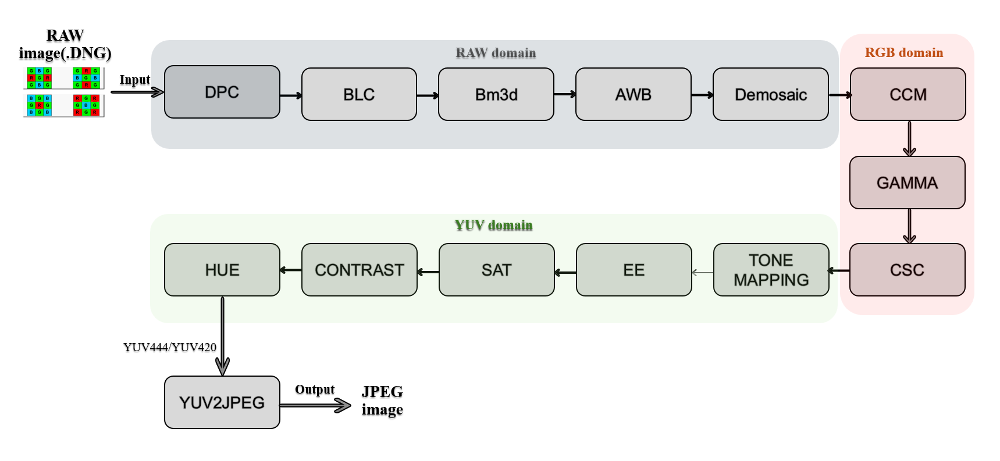

# Open Image Signal Processor (OPENISP_PRO)

## Introduction

**OPENISP_PRO** is a **pure-Python** software ISP that converts **RAW/DNG** from image sensors into display-ready **RGB/YUV** and **JPEG** outputs.  
The pipeline follows a practical, production-minded order—**RAW input → front-end calibration → color reconstruction → back-end enhancement → encoding**—with robust fallbacks, metadata propagation, and intermediate artifacts for quality control and reproducibility.

Key traits:

- **Robust RAW ingest (`rawio`)**: reliable DNG parsing; **hierarchical fallback** for black/white levels (tags → optical black → low-quantile estimation), Bayer pattern detection, bit-depth inference, standardized metadata, and quick sRGB preview.  
- **Quality-first calibration**: DPC with robust statistics + edge-preserving repair; BLC with **two-stage search** to avoid under/over-subtraction; AWB using **bright-region sampling** with gain guards for natural skin/highlights.  
- **Detail-aware denoising**: RAW-domain **BM3D** per-channel (R/Gr/Gb/B) to prevent cross-color bleed; optional YUV-domain **CBM3D** for late-stage refinement.  
- **Luminance-consistent demosaicing**: color-difference interpolation with **G-mean feedback** to keep brightness stable; mild USM only on Y to avoid color shifts.  
- **Color with safety rails** (`ccm`): camera matrices with **mired-domain interpolation** and **Bradford adaptation**; condition-number checks and **graceful fallback** (e.g., blending toward identity).  
- **Stable display mapping**: gamma with **soft lifting** for small negatives; precise **CSC** (BT.601/709/2020, full/limited range).  
- **Tasteful tone & detail shaping**: TMO (filmic/Hable) operates on Y′ only; **EE with dual gating** (MAD + quantization thresholds) to reduce halos/noise.  
- **Color finishing**: saturation (Cb/Cr scaling around neutral), contrast (linear/S-curve/power/HEQ), hue (global rotation + selective edits + highlight warming).  
- **Baseline JPEG encoder**: standards-compliant **JFIF Baseline** in pure Python (AAN FDCT, quantization, RLE, Huffman, 0xFF stuffing) with self-checks.

## Objectives

This project provides a practical, end-to-end ISP reference that is **modular, reproducible, and hardware-inspired**, while remaining approachable in pure Python. Specifically, OPENISP_PRO:

1. **Stimulates the whole ISP pipeline** from RAW ingest to JPEG output, exposing intermediate states for inspection and QA.  
2. **Implements robust front-end corrections** (RAW parsing, DPC, BLC, AWB) using **statistically robust** methods (quantiles, MAD, hierarchical fallback).  
3. **Reconstructs color faithfully** via luminance-consistent demosaicing and a **defensive CCM** (mired interpolation + Bradford + safe fallback).  
4. **Balances visual quality with engineering practicality** using BM3D/CBM3D, tone mapping on Y′, gated sharpening, and decoupled color finishing (Sat/Contrast/Hue).  
5. **Outputs standard formats** (RGB/YUV/JPEG) compatible with common display and downstream pipelines.  

Advanced capabilities such as **LSC (Lens Shading Correction)**, **HDR (multi-exposure fusion)**, and **AF** are planned to further broaden coverage.
    
##  Pipeline Diagrams

<!-- Add your own diagrams into images/ and uncomment the lines below


-->

## Feature Checklist

- [x] Defective Pixel Correction (DPC) — robust detection + edge-aware inpainting  
- [x] Black Level Correction (BLC) — two-stage search, no over/under subtraction  
- [ ] Lens Shading Correction (LSC) — _planned_  
- [x] RAW-domain Noise Reduction — **BM3D** per-channel  
- [x] Auto White Balance (AWB) — bright-region sampling with safety rails  
- [x] Demosaicing — luminance-consistent, color-difference interpolation  
- [x] Gamma Correction — soft lifting for near-zero negatives  
- [x] Color Correction Matrix (CCM) — mired interpolation + Bradford + fallback  
- [x] Color Space Conversion (CSC) — BT.601/709/2020, full/limited range  
- [x] YUV-domain Noise Refinement — **CBM3D** (optional)  
- [x] Edge Enhancement (EE) — USM with dual gating, halo-safe  
- [x] Hue / Saturation / Contrast — decoupled finishing (Y′ vs. Cb/Cr)  
- [x] Baseline JPEG Encoding — JFIF-compliant, 4:4:4 / 4:2:0

## References

[1] Zhihu Zhuanlan. (n.d.). Color Correction Matrix (CCM) — Algorithm Design [in Chinese]. Available: https://zhuanlan.zhihu.com/p/34562544
. Accessed: 2025-10-09.

[2] Zhihu Zhuanlan. (n.d.). ISP Pipeline Overview — YUV Stage [in Chinese]. Available: https://zhuanlan.zhihu.com/p/653352999
. Accessed: 2025-10-09.

[3] Zhihu (Tardis/BD). (n.d.). Automatic White Balance Algorithms: A Comparison [in Chinese]. Available: https://www.zhihu.com/tardis/bd/art/270558150?source_id=1001
. Accessed: 2025-10-09.

[4] 2048ai.net. (n.d.). Automatic White Balance (AWB) Technology [in Chinese]. Available: https://2048ai.net/681dd4dea5baf817cf4a3687.html
. Accessed: 2025-10-09.

[5] CSDN Blog (qrx941017). (n.d.). ISP Image Processing — YUV-Domain Pipeline [in Chinese]. Available: https://blog.csdn.net/qrx941017/article/details/131637811
. Accessed: 2025-10-09.

[6] CSDN Blog (weixin_44690935). (n.d.). Horizon J5 Image Tuning (4): AWB/CCM [in Chinese]. Available: https://blog.csdn.net/weixin_44690935/article/details/141951054
. Accessed: 2025-10-09.

[7] CSDN Blog (YUelite). (n.d.). DPC (Dead Pixel Correction) — Introduction [in Chinese]. Available: https://blog.csdn.net/YUelite/article/details/139933471
. Accessed: 2025-10-09.

[8] DeepinOut. (n.d.). HiSilicon ISP Modules — Intro/Overview [in Chinese]. Available: https://deepinout.com/isp/hisi-isp-module-intro.html
. Accessed: 2025-10-09.

[9] CSDN Blog (wtzhu_13). (n.d.). ISP — Gamma Correction [in Chinese]. Available: https://blog.csdn.net/wtzhu_13/article/details/119533870
. Accessed: 2025-10-09.

[10] CSDN Blog (wtzhu_13). (n.d.). ISP — Pipeline Overview [in Chinese]. Available: https://blog.csdn.net/wtzhu_13/article/details/118255864
. Accessed: 2025-10-09.

[11] Zhihu Zhuanlan. (n.d.). Article [in Chinese]. Available: https://zhuanlan.zhihu.com/p/536544215
. Accessed: 2025-10-09.

[12] Zhihu Zhuanlan. (n.d.). Article [in Chinese]. Available: https://zhuanlan.zhihu.com/p/686901150
. Accessed: 2025-10-09.

[13] Zhihu Zhuanlan. (n.d.). Article [in Chinese]. Available: https://zhuanlan.zhihu.com/p/21983679
. Accessed: 2025-10-09.

[14] FFmpeg Developers. (2023). FFmpeg [Computer software], Version 6.0. Retrieved from https://ffmpeg.org/
. Accessed: 2025-10-09.
## File Structure

The OPENISP_PRO project tree is listed as follows.

```shell
OPENISP_PRO
├── .idea/                # IDE configs (e.g., PyCharm)
├── .venv/                # Python venv (default)
├── .venv1/               # Alternate venv (e.g., other Python/deps)
├── examples/             # Test inputs (RAW/DNG samples)
│   ├── input1.DNG
│   └── input2.DNG
├── lab/                  # Experimental prototypes (e.g., new denoise/HDR)
├── openisp_pro/          # Core ISP implementation
│   ├── core/             # Pipeline stages
│   │   ├── awb.py
│   │   ├── blc.py
│   │   ├── bm3d.py
│   │   ├── cbm3d_yuv.py
│   │   ├── ccm.py
│   │   ├── contrast.py
│   │   ├── csc.py
│   │   ├── demosaic.py
│   │   ├── dpc.py
│   │   ├── ee.py
│   │   ├── fpn.py
│   │   ├── gamma.py
│   │   ├── hue.py
│   │   ├── sat.py
│   │   ├── tmc.py
│   │   └── yuv2jpeg.py
│   ├── utils/
│   │   └── rawio.py       # DNG parsing, BL/WL fallback, bit-depth, preview
│   └── pipeline.py        # RAW→JPEG orchestration + intermediates
```
## Directory Notes

- `utils/rawio.py` — robust RAW ingest (Bayer pattern detection, black/white-level fallback, bit-depth inference) with standardized metadata.
- `openisp_pro/core/*` — individual ISP modules (each testable and swappable).
- `openisp_pro/pipeline.py` — wires modules end-to-end, logs decisions, and can save intermediates for QA.

---

## Usage

After cloning the repo, run the pipeline on a DNG sample:

```bash
cd openisp_pro
python pipeline.py ../examples/a0144-07-11-20-at-16h38m08s-_MG_5725.dng
```

### Notes

* Absolute paths are supported, e.g.:

  ```bash
  python pipeline.py /abs/path/to/input.dng
  ```
* On Windows, quote paths with spaces, e.g.:

  ```powershell
  python pipeline.py "C:\path with space\input.dng"
  ```
* If CLI options like `--out` or `--save-intermediate` are available, append them as needed (see code).

---

## Domain Notes

While algorithms such as **DPC/BLC/AWB/BM3D/Demosaic** operate in the **Bayer/RAW** or **linear RGB** domain, display mapping and finishing steps (e.g., **Gamma/CSC/TMC/EE/Sat/Contrast/Hue**) operate in **R′G′B′/Y′CbCr**.
This split preserves physical linearity early and human-perception alignment late. Noise filtering can be placed in **RAW/RGB/YUV**, and both **temporal/spatial** domains are feasible; **OPENISP_PRO** currently emphasizes **RAW BM3D** with optional **YUV CBM3D** refinement for a balanced quality/perf trade-off.

---

## License
This project is licensed under the **MIT License** - see the [LICENSE](LICENSE) file for details.  
© [2025] OPENISP_PRO Authors
